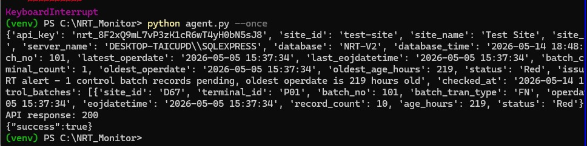
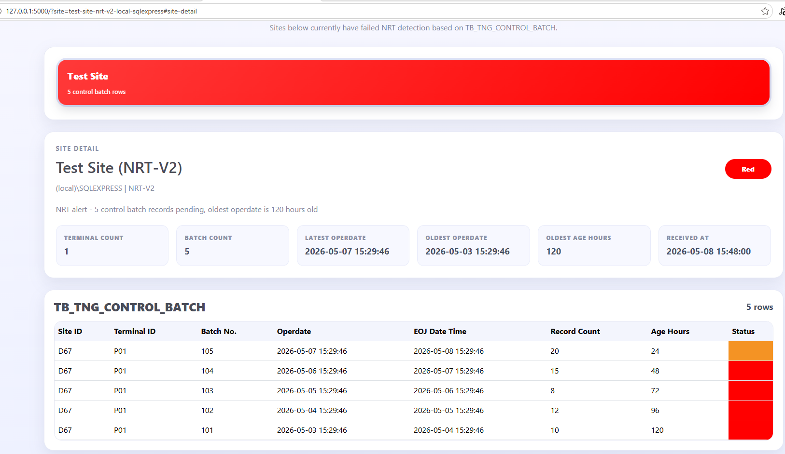

# NRT Monitor

## Project Overview
NRT Monitor is a Python Flask dashboard and site-side collection workflow built to detect failed or delayed Touch 'n Go NRT processing before settlement issues are discovered by clients. A scheduled collector reads site data from SQL Server, evaluates whether control batch records remain stale beyond the configured threshold, and posts the latest status to a central dashboard.

The dashboard is designed as an early-warning view for the internal support team. Only sites with failed NRT detection are shown as status cards, allowing support staff to quickly identify affected locations and open a detailed breakdown of the latest control batch records.

## Project Objectives
The project objective is to provide a lightweight watchdog system for NRT monitoring. It helps the team detect cases where files or lane transaction data are not being processed because of internet issues, lane or PMS transfer failures, Touch 'n Go pickup problems, or backend insertion errors.

The current dashboard behavior follows the monitoring discussion:

- Sites with failed NRT detection are displayed in card format on the main dashboard.
- Clicking a site card reveals the latest site summary and a detailed TNG_CONTROL_BATCH table.
- **Red** indicates stale records older than 48 hours.
- **Orange** indicates stale records under 48 hours but still requiring attention.
- **Green** indicates successful detection and those sites are not shown on the dashboard.

This gives internal support a fast operational view of which sites need investigation before missing or low settlement amounts are reported by clients.

## Tech Stack

| Category              | Tools/Libraries                        |
| --------------------- | -------------------------------------- |
| Frontend              | HTML, CSS, Bootstrap 5, Jinja2         |
| Backend               | Python, Flask                          |
| Data Collection       | pyodbc                                 |
| Integration / Sync    | requests, Google Apps Script           |
| Database              | SQLite, SQL Server (source system)     |
| Environment / Runtime | Python, Python venv                    |


# Instructions to Run
1. **Pre-requisite**
   - Ensure the following software is installed:
     - Google Sheets / Apps Script
     - Python 3.x
     - Microsoft ODBC Driver 17 for SQL Server (x64)

2. **Clone the repository**
   ```bash
   git clone https://github.com/w3ishendt/NRT-Monitor.git
   cd NRT-Monitor
   ```

3. **Create a virtual environment**
   ```bash
   py -m venv venv
   .\venv\Scripts\activate  # On Linux / Mac OS: source venv/bin/activate
   ```
   - If error occurred, run this:
   ```bash
   Set-ExecutionPolicy -ExecutionPolicy RemoteSigned -Scope CurrentUser
   ```

4. **Install dependencies**
   ```bash
   pip install -r requirements.txt
   ```
   
5. **Edit the credentials**
    - In the `agent.py`, edit the following credentials:
   ```bash
   SQL_SERVER = r"(local)\SQLEXPRESS"
   DATABASE = "NRT-V2"
   SITE_NAME = "Test Site"
   SITE_CODE = DATABASE
   API_URL = "https://script.google.com/macros/s/your_api_url/exec"
   API_KEY = "your_api_key"
   DASHBOARD_API_URL = "http://127.0.0.1:5000/api/nrt-status"

   ALERT_THRESHOLD_HOURS = 48
   COLLECTION_INTERVAL_MINUTES = 40
   STARTUP_LAUNCHER_NAME = "NRT Monitor Collector.cmd"

   CONNECTION_STRING = (
      "DRIVER={ODBC Driver 17 for SQL Server};"
      f"SERVER={SQL_SERVER};"
      f"DATABASE={DATABASE};"
      "UID=your_UID;"
      "PWD=your_PWD;"
      "Trusted_Connection=yes;" # Comment this if using SQL auth and provide UID/PWD
   )
   ```

6. **Run the application**
    - Place both program one in the Central Server, another in the client site
    - On the Central Server, run:
   ```bash
   python app.py
   ```
   - On the client's site, run::
   ```bash
   python agent.py
   ```
   - Expected output upon successful run:
   <p align="center">
   
   </p>

# User Interface Layout
<p align="center">

</p>